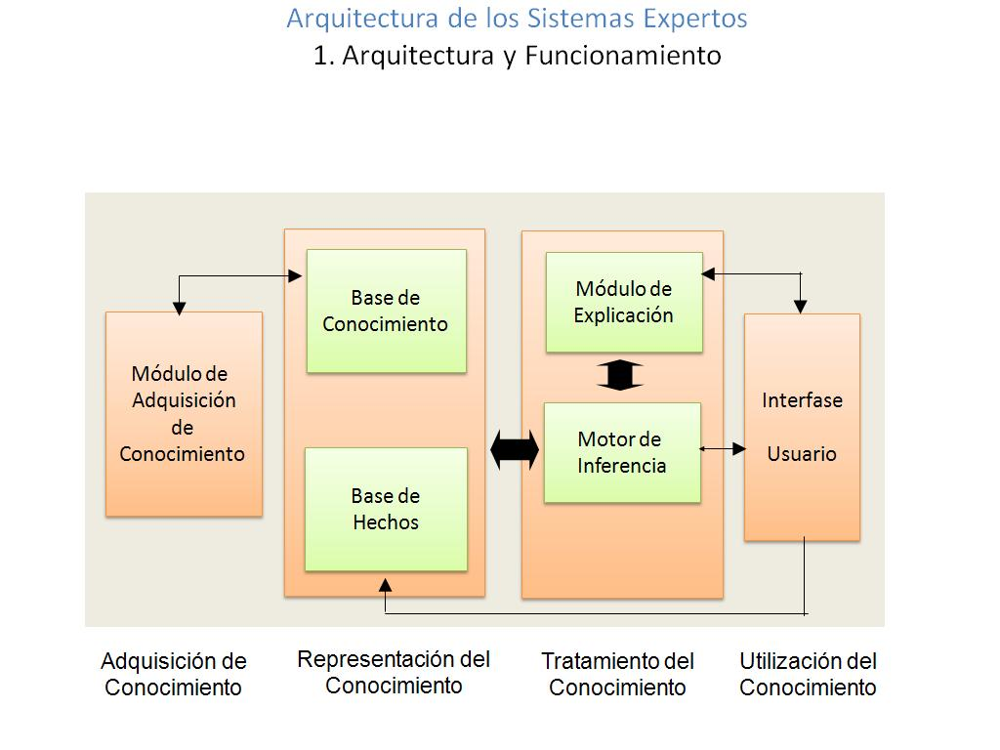

## Sistemas Expertos Computación Blanda
### Expert Systems Soft Computing
### Autor 1: Stiven Cardona Monsalve

Ingeniería de Sistemas y Computación, Universidad Tecnológica de Pereira, Pereira, Colombia

Correo-e: <cardona-627@utp.edu.co>

**Resumen**—​ ​Los Sistemas Expertos son una rama de la Inteligencia Artificial cuyo propósito es simular el comportamiento de un experto humano. Para ello se establece una arquitectura cuyo corazón es un motor de inferencia soportado por una base de conocimiento, organizada en hechos, reglas y meta reglas. El motor de inferencia obedece a patrones de entrada iterando a lo largo de la base de conocimiento, encontrando hechos u objetos que resuelven en lógica de predicados de primer orden (o en el ámbito de la lógica difusa), un objetivo específico. El Sistema Experto requiere para lograr su propósito de la utilización de una agenda temporal en donde almacena el resultado de todas y cada una de las acciones de inferencia. Globalmente, el Sistema Experto requiere disponer de un módulo de aprendizaje a través del cual mejora su sistema de inferencia con base en la experiencia. El Motor de búsqueda de conocimiento opera en tres niveles posibles: directo, inverso e híbrido. Para el desarrollo de Sistemas Expertos se dispone de herramientas computacionales y lenguajes tanto imperativos como funcionales.

**Palabras clave**— Sistemas ​ Expertos, Lógica Difusa, Aprendizaje, Patrones, Inferencia, Motor de Inferencia, Agenda, Hechos, Reglas, Meta Reglas, Directo, Inverso, Híbrido, Entrada, Salida, Base de Conocimiento, Inteligencia Artificial, Agente Inteligente. Acción, Reacción, Incertidumbre, Verdadero, Falso, Red Neuronal.

**Abstract**​— ​The Expert Systems are a branch of Artificial Intelligence whose purpose is to simulate the behavior of a human expert. To do this, the architecture is established whose heart is an inference engine supported by a knowledge base, organized into facts, rules and meta rules. The inference engine obeys to input patterns iterating along the knowledge base, finding facts or objects that solve in logic of first order predicates (or in the field of fuzzy logic), a specific objective. The Expert System requires achieving its purpose of using a temporary agenda where it stores the result of each and every one of the inference actions. Globally, the Expert System requires having a learning module through which it improves its inference system based on experience. The Knowledge Search Engine operates in three possible levels: direct, inverse and hybrid. For the development of Expert Systems, computational tools and languages are available, both imperative and functional.

**Key Word** —​ ​Expert Systems, Fuzzy Logic, Learning, Patterns, Inference, Inference Engine, Agenda, Facts, Rules, Goal Rules, Direct, Inverse, Hybrid, Input, Output, Knowledge Base, Artificial Intelligence, Intelligent Agent. Action, Reaction, Uncertainty, True, False, Neural Network.

**I. INTRODUCCIÓN**

La Inteligencia Artificial (IA) es una línea de investigación, innovación y desarrollo tecnológico en el campo de la informática, cuyo objetivo es el entender la forma de pensar del ser humano, de modo que sea posible la construcción de máquinas y sistemas que puedan comportarse como lo haría un ser humano frente a la solución de un problema. Existen dos grandes tendencias en este campo: los modelos conexionistas y los modelos simbólicos. El primero, el conexionista, busca desarrollar procesos inteligentes copiando la estructura del cerebro, y para ello recurre a la combinación artificial de elementos físicos o virtuales, que generan un principio inteligente de manera emergente. El modelo simbólico busca generar inteligencia a partir del estudio de las leyes del pensamiento plasmadas en combinaciones forales de símbolos, buscando con ello que los conceptos base de la inteligencia se manifiesten de manera emergente como entidades que resuelven problemas de manera similar al ser humano. 

Los Sistemas Expertos (SE) son una de las apuestas de desarrollo tecnológico en el campo simbólico. A través de su uso, la capacidad humana de enfrentar problemas a través de razonamientos que exploran bases de conocimiento, hechos conocidos y reglas estándar de comportamiento, los Sistemas Expertos Artificiales han llegado a no diferir mucho del equivalente humano en dominios concretos del conocimiento.

El presente documento explora los principales tópicos asociados a la tecnología de la Computación Blanda asociada a los Sistemas Expertos.

**II. DESARROLLO DEL TEMA**

Los sistemas expertos se basan en un modelo computacional que busca simular la capacidad de un experto humano.
Algunas definiciones aclaratorias se exponen a continuación:
“Sistema experto (ES, siglas del término Expert System) es un sistema de información basado en el conocimiento que usa su conocimiento de un área de aplicación compleja y específica a fin de actuar como un consultor experto para los usuarios finales. Los sistemas expertos proporcionan respuestas sobre un área problemática muy específica al hacer inferencias semejantes a las humanas sobre los conocimientos obtenidos en una base de conocimientos especializados.”[1]
“Los Sistemas Expertos (SE) pueden ser considerados como un subconjunto de la IA (Rossini, 2000). El nombre Sistema Experto deriva del término “sistema experto basado en conocimiento”. Un Sistema Experto es un sistema que emplea conocimiento humano capturado en una computadora para resolver problemas que normalmente requieran de expertos humanos. Los sistemas bien diseñados imitan el proceso de razonamiento que los expertos utilizan para resolver problemas específicos. Dichos sistemas pueden ser utilizados por no-expertos para mejorar sus habilidades en la resolución de problemas. Los SE también pueden ser utilizados como asistentes por expertos. Además, estos sistemas pueden funcionar mejor que cualquier humano experto individualmente tomando decisiones en una específica y acotada área de pericia, denominado como dominio (Turban, 1995).” [2]

**EVOLUCIÓN HISTÓRICA**

Se tiende a pensar que la historia de la inteligencia artificial se remonta a 3, 5 o 10 años atrás cuando en realidad se remonta a los años 50, momento en el que Alan Mathison Turing publicó “Maquinaria Computacional e Inteligencia” la cual quería demostrar hasta qué punto las máquinas poseían inteligencia. A raíz de esto nacen varios significados del concepto de inteligencia en una máquina.

Una de las definiciones más importantes se da en el año 1971 cuando Alexander Sporl en su obra titulada "Sporls-Computerbuch" dice: Bajo Inteligencia entiendo la capacidad de un ser vivo o una máquina de ordenar
informaciones, extensas observaciones, experiencias, descubrir interrelaciones para abstraer de esta forma cosas y poderlas ligar entre sí.

Uno de los primeros sistemas expertos recibe el nombre de Dendral, con la capacidad para calcular y descubrir a partir de datos químicos, hechos relativos a la estructura molecular los cuales no estaban elaborados. Con el paso de los años nuevas implementaciones de sistemas expertos fueron surgiendo, y el campo de la inteligencia artificial forjó nuevas y firmes bases, desde el nacimiento de nuevos lenguajes de programación basados en el paradigma lógico como Prolog hasta nuevos sistemas expertos como Teiresias Finalmente a medida que la tecnología informática avanza el campo de la Inteligencia Artificial se potencia, y con ello los sistemas expertos que van de la mano de estas ciencias asociadas a las computación

**ARQUITECTURA** 

Base de conocimiento: En esta parte se contiene el conocimiento, en ella tenemos reglas a través de las cuales describimos reglas que relacionan objetos entre sí.

Base de hechos: Memoria temporal que contiene hechos que se han descubierto mientras se solucionan problemas, valores iniciales u obtenidos a través de operaciones intermedias.

Motor de inferencia o intérprete de reglas: Se encarga con de usar la base de conocimientos y la base de hechos para generar nuevas reglas.

Subsistema de explicación: A través de este subsistema el sistema el sistema experto explica al usuario preguntas que está realizando y el cómo ha llegado a las mismas.

Interfaz de usuario: Sistema encargado de la comunicación entre el usuario y el sistema.

Módulo de adquisición de conocimiento: Se encarga de facilitarle al sistema experto la construcción y modificación de la base de conocimientos.

Módulo de comunicaciones: Este módulo permite al sistema experto la comunicación con el ambiente 

**TIPOS DE LENGUAJES UTILIZADOS**

_Prolog:_ Lenguaje de programación lógico e interpretado, ampliamente usado en el campo de la inteligencia artificial y en el diseño de sistemas expertos, debido al paradigma en el que se encuentra el cual está orientado para esta rama de las ciencias informáticas.

_Lisp:_ Lisp debe su nombre a ser conocido como list processor es decir procesamiento de listas, y esto es básicamente porque la estructura de datos más importante de este lenguaje es la lista, internamente Lisp está compuesto de listas y con ellas maneja la recursividad en la que está 
basado el lenguaje, es usado ampliamente en el campo de la inteligencia artificial debido a su facilidad para manipular el código fuente como si fuese una estructura de datos, esto permite de manera más sencilla inferir nuevo conocimiento.

**TIPOS DE HERRAMIENTAS UTILIZADAS**

_SWI-PROLOG:_ Herramienta que implementa el lenguaje, prolog ampliamente conocido y usado en el campo de la IA, al principio fue usado para el procesamiento de lenguaje natural, pero con el tiempo adquirió popularidad en el desarrollo de sistemas expertos.

_CBR Express:_ Herramienta basada en la existencia de una librería de casos resueltos, de esta manera cuando se presenta una nueva situación el sistema recupera casos que se adapten lo mejor posible al actual para que el usuario pueda interpretar o ajustar la solución.

_ESB (Expert Build System) :_ Kit de herramientas de IA implementado con common lisp con la intención de industrializar el proceso de construcción de sistemas expertos.

**VENTAJAS DE LOS SISTEMAS EXPERTOS**

- Los conocimientos adquiridos por los sistemas expertos, pueden ser fácilmente almacenados y copiados, característica que hace que la
información perdure en el tiempo.

- Los sistemas expertos son programas por tanto, su rendimiento siempre será estable, es decir no variará su rendimiento por limitaciones físicas
como el cansancio.

- Los sistemas expertos después de construidos pueden ser fácilmente clonados, obteniendo de manera rápida varios sistemas con capacidades
similares.

**DESVENTAJAS DE LOS SISTEMAS EXPERTOS**

- En los sistemas expertos tenemos ausencia de creatividad para resolver problemas

- Los sistemas expertos carecen de experiencia sensorial .

- Los sistemas expertos no son buenos para resolver problemas fuera de su área de conocimiento

**EJEMPLOS DE PROBLEMAS RESUELTOS CON SISTEMAS EXPERTOS**

- Los sistemas de diagnosis siguen un proceso de búsqueda de las razones del funcionamiento incorrecto de un sistema a partir de la información
disponible. Aquí se podrían tener en cuenta tanto aplicaciones de diagnóstico médico como de averías: PULMONOLOGIST es un prototipo de
SEM diseñado para ayudar a tomar decisiones diagnósticas terapéuticas en enfermedades pulmonares. No reemplaza al especialista pero puede ayudar al médico a resolver ciertas dificultades cuando no cuenta con aquel

**III. CONCLUSIONES**

- Los Sistemas Expertos representan una revolución en la manera de trabajo de las empresas, los mismos son un avance en la automatización de tareas y desarrollo de sistemas capaces de simular el comportamiento humano a la hora de resolver problemas y aprender del entorno adaptación

- En la actualidad hemos visto un crecimiento acelerado de la tecnología, que ha dejado herramientas que impulsan el crecimiento del campo de la inteligencia artificial, facilitando tanto el aprendizaje como la construcción de Sistemas Expertos

**PREGUNTAS LIGADAS A SISTEMAS EXPERTOS**

En esta sección se plantean algunas cuestiones cuyas respuestas arrojan luz adicional sobre la naturaleza de los Sistemas Expertos y sus campos específicos de aplicación.

Preguntas:

1) ¿Cuál es el impacto del proyecto CyC (OpenCyC) en el futuro de la Inteligencia Artificial?

R/. Este proyecto plantea una posibilidad de crear sistemas expertos, modernos y con una capacidad de razonamiento parecida a la humana. Por lo anterior tenemos claramente un cambio en la forma de desarrollar sistemas inteligentes, lo que ayuda a crear un avance constante y sostenido en los próximos años.

2) ¿Cuál es la razón para que se prefieran (en algunas circunstancias) la utilización de lenguajes funcionales tipo PROLOG en el proceso de construcción de Sistemas Expertos, en oposición a lenguajes imperativos como JAVA?

R/. Esto se debe principalmente a la facilidad con que estos lenguajes permiten desarrollar reglas e inferir conocimiento, a partir de reglas definidas, son lenguajes que le llevan mucha ventaja a los basados en el paradigma imperativo a la hora de construir e inferir conocimiento.

3) La heurística es una de las características más sobresalientes de la capacidad humana para resolver problemas de manera eficiente. ¿Podrá alguna vez emularse esta capacidad en un sistema experto? ¿Hasta qué punto podrá alcanzarse esta habilidad en un sistema artificial? ¿Qué tópicos deberían abordarse para alcanzar esta habilidad en un sistema artificial?

R/. Emular la inteligencia humana es algo que está muy lejos de lograrse y es que para aprender, hace falta razonamiento filosófico e independencia cognitiva un factor que no poseen los sistemas expertos actuales. Los sistemas expertos pueden esquematizar heurísticas para las que fueron creados, pero están limitados a un área de conocimiento ya que mezclar demasiadas puede generar un comportamiento inadecuado del sistema. Para crear un sistema artificial ideal se debe analizar primero la capacidad de aprendizaje del ser humano, más que su capacidad para procesar información es como procesarla y qué concluir de la misma.

4) Enumere un grupo de problemas de la región cuya solución pudiera abordarse con la aplicación sistemática de Sistemas Expertos.

R/. Corrupción en las cortes de justicia, con sistema que pudiera inferir a partir de las leyes de una nación, una sentencia exacta, lo que evitaría la manipulación en los procesos legales. Crisis económica de un país, con sistema que conozca los aspectos fundamentales tanto sociales como políticos, se podría crear una base de conocimiento que permita sacar
conclusiones acerca de los motivos que generan esa situación de riesgo.

5) ¿Por qué razón el módulo de aprendizaje debe construirse mediante la utilización de una Red Neuronal? Justifique su respuesta.

R/. Porque para aprender debemos generar conexiones nuevas y modificar otras existentes, este concepto de aprendizaje se logra a través de las redes neuronales en la actualidad.

**REFERENCIAS**

[1] Sistemas Expertos. ECURED. (2018) Disponible en: https://www.ecured.cu/Sistemas_expertos

[2] Sebastián Badaró, Leonardo Javier Ibañez y Martín Jorge Agüero. “Sistemas Expertos: Fundamentos, Metodologías y Aplicaciones”. (2013) Disponible en: https://www.palermo.edu/ingenieria/pdf2014/13/CyT_13_24.pdf:

[3]Sistemas expertos y su aplicación en la medicina (1991) Disponible en: https://aprendeenlinea.udea.edu.co/revistas/index.php/iatreia/article/view/3457/3219
